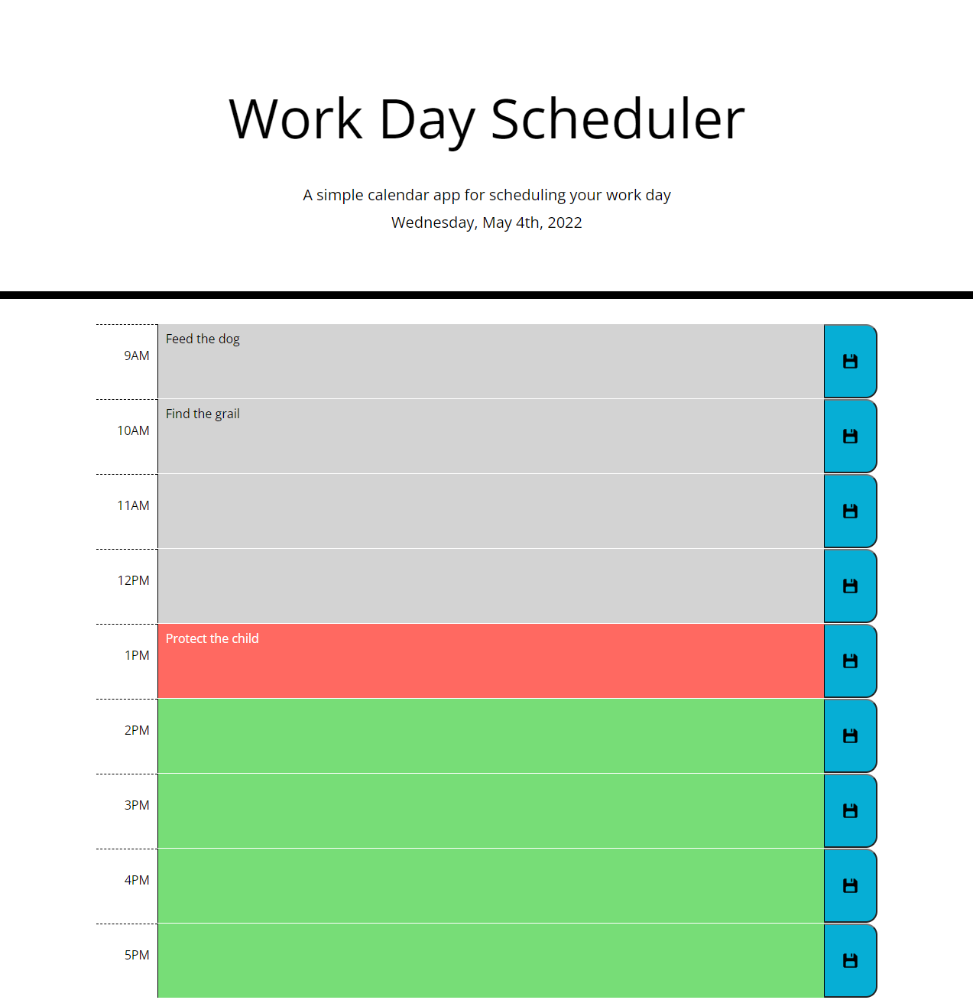

# Work Day Scheduler

## License

  # 

  Begin license text.
    Copyright 2022  Bryan Schenck
    
    Permission is hereby granted, free of charge, to any person obtaining a copy of this software and associated documentation files (the "Software"), to deal in the Software without restriction, including without limitation the rights to use, copy, modify, merge, publish, distribute, sublicense, and/or sell copies of the Software, and to permit persons to whom the Software is furnished to do so, subject to the following conditions:
    
    The above copyright notice and this permission notice shall be included in all copies or substantial portions of the Software.
    
    THE SOFTWARE IS PROVIDED "AS IS", WITHOUT WARRANTY OF ANY KIND, EXPRESS OR IMPLIED, INCLUDING BUT NOT LIMITED TO THE WARRANTIES OF MERCHANTABILITY, FITNESS FOR A PARTICULAR PURPOSE AND NONINFRINGEMENT. IN NO EVENT SHALL THE AUTHORS OR COPYRIGHT HOLDERS BE LIABLE FOR ANY CLAIM, DAMAGES OR OTHER LIABILITY, WHETHER IN AN ACTION OF CONTRACT, TORT OR OTHERWISE, ARISING FROM, OUT OF OR IN CONNECTION WITH THE SOFTWARE OR THE USE OR OTHER DEALINGS IN THE SOFTWARE.
    
  End license text.

## Table of Contents

- [Description](#description)
- [Usage Tips](#usage-tips)
- [Contact](#contact)

## Description

This app displays the normal 9 to 5 workday and colors codes the time blocks according to current time. It also allows the user to enter and save tasks for each hour.

[Deployed site](https://brysgithub.github.io/work-day-scheduler-hw5/)

## Usage Tips

This app is pretty simple. If it doesn't save try clicking outside of the save button first.

## Contact

Github: [brysgithub](https://github.com/brysgithub)